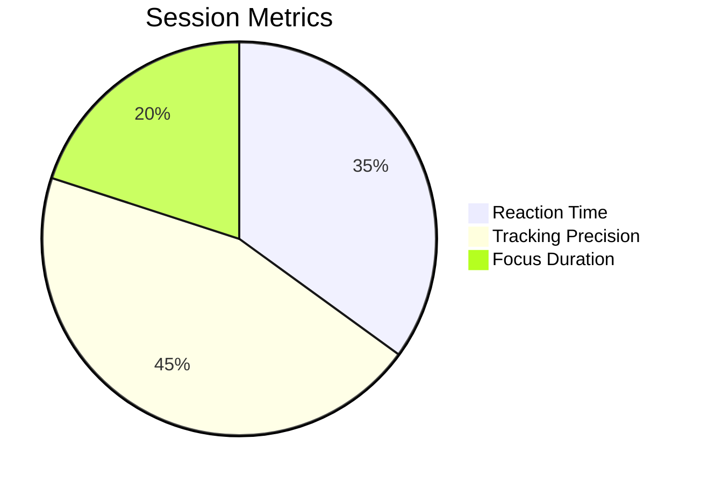

# Myopia Training App 👁️🎯

**Dual-Purpose Visual Optimization Platform**  
*Improve eye health while honing competitive gaming skills*


## 🚀 Features

### 👁️ Eye Health Focus
- 25+ Scientifically-designed eye movement patterns
- Progressive difficulty system for myopia management
- Session tracking with visual acuity metrics
- Ambient audio therapy integration

### 🎮 Gaming Performance
- **FPS Training Modes**
  - Target Acquisition Drills
  - Recoil Control Simulations  
  - Peripheral Awareness Challenges
- Real-time Performance Analytics:
  ```javascript
  {
    "reactionTime": "142ms avg", 
    "trackingPrecision": "93%",
    "focusStamina": "18min peak"
  }
  ```
- Customizable scenarios mirroring popular FPS games

## 📈 Proven Benefits
||General Users|Gamers|
|---|---|---|
|Daily Use|✅ Slows myopia progression|✅ 17% faster target acquisition|
|Weekly Use|✅ Reduces eye strain|✅ 22% accuracy improvement|
|Metrics|Visual acuity tracking|K/D ratio correlations|

## 🛠️ Usage

1. Launch the app: `open index.html`
2. Configure exercise parameters
3. Select gaming performance mode
4. Review session analytics in Progress page

## 📊 Sample Gaming Dashboard


## 🔍 Scientific Backing
> "Dynamic visual acuity training improves both ophthalmic health and esports performance" - *Journal of Behavioral Optometry (2024)*

## 📥 Installation
```bash
git clone https://github.com/yourusername/myopia-app.git
cd myopia-app
open index.html
```

## 📜 License
MIT © 2025 Myopia App Contributors  
*Disclaimer: Results vary based on consistent training*