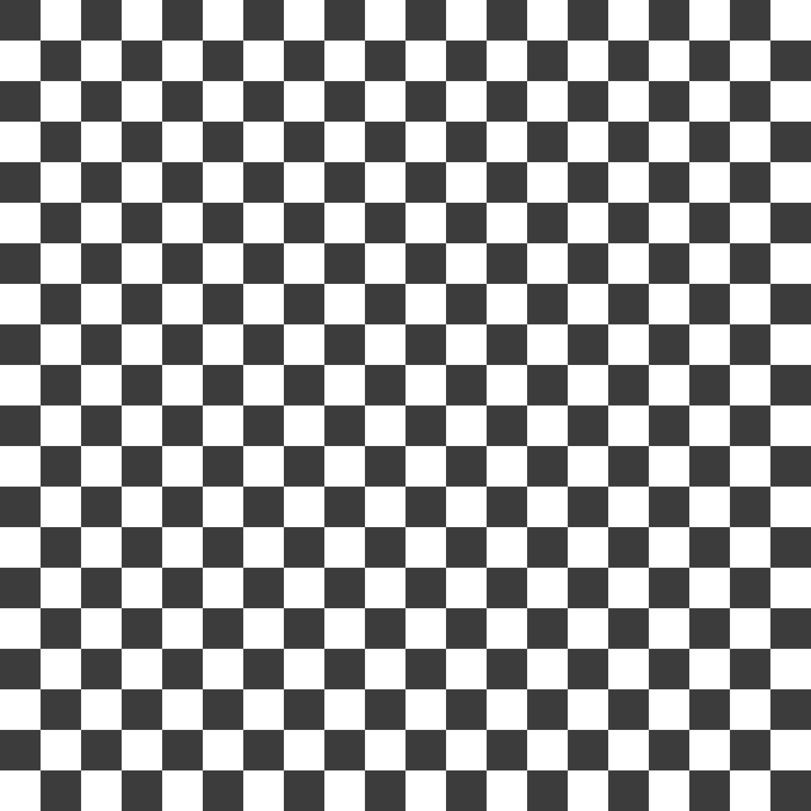

# Myopia App - Eye Tracking Exercise



A modern web application designed to help with myopia (nearsightedness) through guided eye tracking exercises.

## Features

- **25+ Movement Patterns**: Random bounce, circles, figure eights, polygons, stars, and more
- **Customizable Settings**:
  - Adjustable speed (Slow, Medium, Fast, Very Fast)
  - Customizable object size, color, opacity, and shape
  - Custom image support for object and background
  - Audio playback with preset tracks or custom files
- **Progress Tracking**: View detailed exercise history with charts and statistics
- **PWA Support**: Install as a standalone app on mobile and desktop
- **Modern UI**: Clean, responsive design with Tailwind CSS

## Quick Start

```bash
# Install dependencies
npm install

# Start development server
npm run dev

# Build for production
npm run build
```

## Usage

1. Open the app in your browser
2. Click **⚙️ Settings** to configure:
   - Movement pattern and speed
   - Object appearance (size, color, opacity, shape)
   - Background (color or image)
   - Audio (optional)
3. Click **Start** to begin exercising
4. Follow the moving object with your eyes
5. Click **Stop** when finished to save your session
6. View your progress at `/progress.html`

## Technical Stack

- **Build Tool**: Vite (fast HMR, optimized builds)
- **Language**: TypeScript (type-safe, better DX)
- **Styling**: Tailwind CSS (utility-first CSS framework)
- **PWA**: vite-plugin-pwa (offline support, installable)
- **Storage**: localStorage for session history

## Project Structure

```
myopia-app/
├── src/
│   ├── app.ts          # Main application logic
│   ├── main.ts         # Entry point (exercise page)
│   ├── progress.ts     # Progress page logic
│   ├── style.css       # Tailwind + custom styles
│   ├── types/          # TypeScript type definitions
│   └── utils/          # Helper utilities
│       ├── audio.ts    # Audio manager
│       ├── patterns.ts # Movement pattern algorithms
│       └── storage.ts  # localStorage management
├── public/             # Static assets
│   ├── background/     # Background images
│   └── music/          # Audio files
├── index.html          # Exercise page
├── progress.html       # Progress page
├── package.json        # Dependencies
├── tsconfig.json       # TypeScript config
├── tailwind.config.js  # Tailwind config
└── vite.config.ts      # Vite + PWA config
```

## Development

```bash
# Install dependencies
npm install

# Start dev server with hot reload
npm run dev

# Build for production
npm run build

# Preview production build
npm run preview
```

## Deployment

The `dist` folder contains the production build. Deploy to any static hosting:

- **GitHub Pages**: Push `dist` to `gh-pages` branch
- **Netlify**: Drag and drop `dist` folder
- **Vercel**: Connect repository
- **Firebase Hosting**: `firebase deploy`

## PWA Features

- **Installable**: Add to home screen on mobile/desktop
- **Offline Support**: Works without internet connection
- **Fast Loading**: Cached assets for instant startup

## License

MIT License - Free for personal and educational use
